# Lifeline: Emergency Fall-to-Hospital Routing


**A mobile-first emergency response app that detects senior falls, speaks to the patient, listens for help, and routes the case to the most clinically appropriate hospital.**

## What It Does

Lifeline combines browser-based fall detection with a real emergency routing layer:

- Edge-AI fall monitoring UI
- Real browser webcam pose detection using TensorFlow.js MoveNet
- Prop Demo mode for safe live demos using a red or dark pen
- Critical fall alert screen based on the provided mobile UI design
- Real browser text-to-speech emergency prompts
- Browser speech recognition for "OK" and "Help"
- 59-second emergency call countdown
- Press-and-hold cancel interaction
- Emergency route-ready screen with GPS-style map
- Caregiver and hospital call cards
- Emergency timeline
- FastAPI backend that scores hospitals by ETA, public facility metadata, and clinical specialty
- Real backend AI-agent pipeline with live SSE streaming

## Why It Matters

Most fall detection demos stop at "fall detected." Lifeline continues the workflow into the golden-hour response:

1. Is the patient okay?
2. Did the patient respond?
3. What clinical capability is needed?
4. Which hospital is clinically appropriate, not just nearest?
5. Who needs to be notified?

## Tech Stack

| Layer | Technology |
| --- | --- |
| Frontend | React + Vite + TypeScript |
| UI | Custom CSS, mobile-first phone UI |
| Icons | Lucide React |
| Pose Detection | TensorFlow.js MoveNet SinglePose Lightning |
| Prop Detection | Canvas color segmentation + orientation heuristic |
| Voice Output | Browser SpeechSynthesis API |
| Voice Input | Browser SpeechRecognition / webkitSpeechRecognition |
| Backend | FastAPI |
| API | `/api/dispatch`, `/api/dispatch/stream`, `/api/health` |
| Agent Runtime | Python async sequential agents with shared state |
| Streaming | Server-Sent Events from backend to React |
| Hospital Data | OpenStreetMap Overpass API |
| Routing Logic | Clinical triage + specialty matching + public hospital metadata |

## Architecture

```mermaid
flowchart LR
  A["Edge-AI Fall UI"] --> B["Voice Prompt"]
  B --> C["Speech Recognition"]
  C --> D["Emergency Trigger"]
  D --> E["FastAPI SSE Stream"]
  E --> F["TriageAgent"]
  F --> G["SpecialtyMatchAgent"]
  G --> H["HospitalSearchAgent"]
  H --> I["CapacityAgent"]
  I --> J["RoutingAgent"]
  J --> K["AdmissionAgent"]
  K --> L["NotifyAgent"]
  L --> M["React Dispatch Screen"]
```



## Real AI Agents

The project now includes actual backend agents, not only frontend labels.

Each agent is a Python class with one job:

- `TriageAgent` classifies emergency severity and required clinical capability.
- `SpecialtyMatchAgent` maps symptoms to trauma, orthopedics, ICU, imaging, neuro, or cardiac requirements.
- `HospitalSearchAgent` discovers nearby hospitals from OpenStreetMap Overpass API.
- `CapacityAgent` audits public hospital metadata and does not fabricate live bed or ICU availability.
- `RoutingAgent` scores hospitals using ETA, specialty coverage, trauma capability, and public phone metadata.
- `AdmissionAgent` prepares an ER call handoff packet.
- `GeminiReasoningAgent` uses Gemini API for the dispatcher briefing when configured.
- `NotifyAgent` prepares caregiver and hospital phone links plus a handoff summary.

The agents run sequentially through shared backend state, similar to the referenced winning architecture. The frontend subscribes to `/api/dispatch/stream` with Server-Sent Events and updates the agent cards as the backend emits `active`, `done`, and `complete` events.

This means the demo is doing real backend orchestration:

```text
React REQUEST HELP
→ EventSource /api/dispatch/stream
→ FastAPI starts async agent pipeline
→ each agent writes to shared state
→ each result streams to UI live
→ final dispatch payload renders emergency screen
```

## Run Locally

Install frontend dependencies:

```bash
npm install
```

Install backend dependencies:

```bash
pip install -r requirements.txt
```

Start backend:

```bash
uvicorn app:app --reload --host 127.0.0.1 --port 8000
```

Gemini setup:

```env
GEMINI_API_KEY=your_google_ai_studio_key
GEMINI_MODEL=gemini-3.6-flash
```

Start frontend:

```bash
npm run dev
```

Open:

```text
http://127.0.0.1:5173
```

## Demo Flow

1. Open the Lifeline mobile dashboard.
2. Click **Simulate Fall**.
3. The app speaks: "Critical. Potential fall detected. Are you okay?"
4. Tap **Tap for Voice Check** and say "OK" or "Help", or use the buttons.
5. If help is requested, the frontend opens a live SSE stream to the FastAPI agent backend.
6. Watch the real backend agents complete one by one.
7. The app shows the selected real hospital record, ETA, GPS-style map, caregiver link, hospital phone link, timeline, and AI routing reason.

For a safer live demonstration, switch to **Pen Demo**, start the camera, hold a red or dark pen vertically, then lay it horizontally. Lifeline detects the prop's fall orientation and triggers the same emergency workflow.

## Real Data Integrity

Real:

- React app
- FastAPI backend
- Webcam-based MoveNet pose estimation
- Fall heuristic using torso orientation, hip height, and rapid descent
- Pen-demo heuristic using canvas color segmentation and object orientation
- Real Python agent classes
- Live SSE backend-to-frontend streaming
- OpenStreetMap Overpass API hospital discovery
- Gemini API briefing when configured
- Browser GPS coordinates when permission is granted
- Browser voice output
- Browser speech recognition where supported
- `tel:` caregiver and hospital call links
- Interactive countdown, buttons, state transitions, and backend agent call

Not fabricated:

- Live hospital bed or ICU availability is not invented if no public feed is available.
- The prototype prepares call links; it does not secretly contact emergency services.
- Caregiver SMS/WhatsApp is not claimed unless an external messaging API is connected.

This is a hackathon prototype and should not be used as medical advice or an emergency dispatch system.

## Future Scope

- MediaPipe pose estimation from webcam or RTSP camera
- Real IoT camera integration
- Verified hospital capacity API integrations
- WhatsApp/SMS caregiver alerts
- Ambulance dispatch integrations
- Bilingual voice commands in English and Chinese
- Mobile PWA install mode
