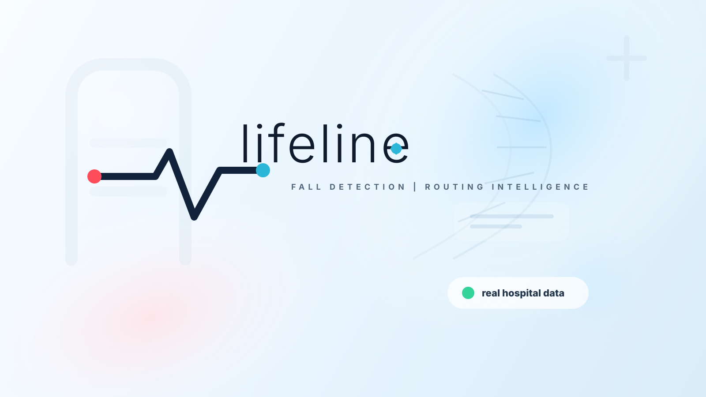
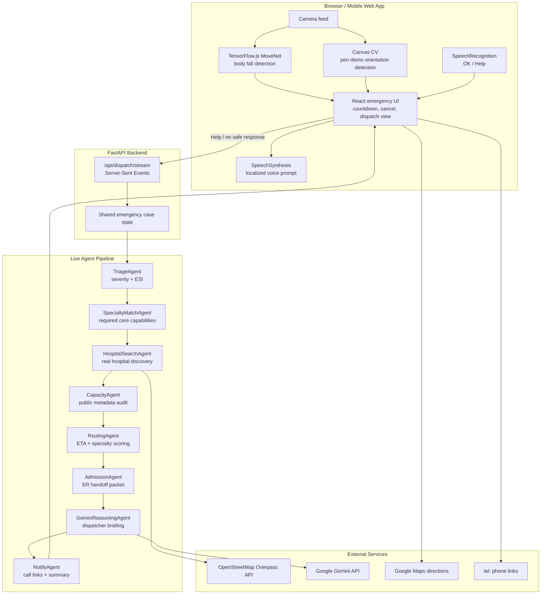

# Lifeline

Fall detection should not stop at **"fall detected."**

Lifeline is a healthcare emergency companion for seniors living alone. It detects potential falls from the browser camera, speaks in the user's selected language, listens for **OK** or **Help**, runs a live multi-agent emergency pipeline, searches real nearby hospitals, and prepares call + map routing to the right care.



## What it does

Lifeline turns a possible senior fall into a full emergency routing workflow:

1. **Monitors locally from the browser camera** using body-pose detection or a safe pen-demo mode.
2. **Detects potential falls** from body orientation, sudden descent, or prop orientation during demos.
3. **Speaks to the patient** in the selected language and asks whether they are okay.
4. **Listens for voice responses** such as "OK" or "Help" using browser speech recognition.
5. **Starts a visible countdown** when there is no safe response, with a press-and-hold cancel control.
6. **Runs a real backend agent pipeline** through FastAPI and Server-Sent Events.
7. **Searches real nearby hospitals** through OpenStreetMap Overpass API.
8. **Ranks hospital options** using ETA, specialty match, public metadata, and phone availability.
9. **Generates a Gemini dispatcher briefing** explaining the routing decision.
10. **Prepares real call links and Google Maps directions** for the caregiver and selected hospital.

Lifeline does not secretly dispatch an ambulance or pretend to reserve a bed. It prepares the fastest human-actionable next step using real agents and real public data.

## Key features

- **Senior-focused emergency flow** — built around the moment after a fall: voice check, no-response countdown, safe cancel, and escalation.
- **Multilingual voice experience** — the selected language controls later emergency prompts and voice recognition behavior.
- **Computer vision fall detection** — TensorFlow.js MoveNet for body posture and a camera-based pen demo for safe live presentations.
- **Live multi-agent orchestration** — each backend agent writes to shared state and streams its status to the frontend over SSE.
- **Real hospital discovery** — `HospitalSearchAgent` calls OpenStreetMap Overpass API instead of reading from a hardcoded hospital list.
- **Transparent capacity handling** — the app does not fabricate live bed or ICU availability when public feeds are unavailable.
- **Gemini decision support** — the final briefing explains urgency, why the selected hospital was chosen, and what should be handed off.
- **Human-callable outputs** — `tel:` links and Google Maps directions make the result immediately actionable.

## Architecture



## Agent pipeline

| Stage | What happens | Real input / tool |
| --- | --- | --- |
| Detect | Browser camera detects body posture or pen-demo fall orientation. | Webcam frames, TensorFlow.js, Canvas |
| Voice Check | Lifeline speaks in the selected language and listens for OK / Help. | Web Speech APIs |
| `TriageAgent` | Classifies emergency severity and required urgency. | Symptoms, age, vitals, response status |
| `SpecialtyMatchAgent` | Maps the case to emergency, trauma, orthopedics, neuro, cardiac, or ICU-related needs. | Triage output |
| `HospitalSearchAgent` | Searches nearby real hospitals. | OpenStreetMap Overpass API |
| `CapacityAgent` | Audits public hospital metadata and reports when live bed/ICU data is unavailable. | Public OSM metadata |
| `RoutingAgent` | Scores hospitals by ETA, specialty match, public metadata, and phone availability. | Candidate hospitals |
| `AdmissionAgent` | Builds an ER call handoff packet. | Selected hospital |
| `GeminiReasoningAgent` | Generates a concise dispatcher-style explanation. | Gemini API |
| `NotifyAgent` | Prepares caregiver call, hospital call, map directions, and handoff summary. | Phone links + routing result |

## Tech stack

| Layer | Technology |
| --- | --- |
| Frontend | React 19 + Vite 8 + TypeScript |
| Styling | Custom responsive CSS, mobile-first phone UI |
| Icons | Lucide React |
| Computer Vision | TensorFlow.js MoveNet SinglePose Lightning |
| Demo CV | Canvas color segmentation + orientation heuristic |
| Voice Output | Browser SpeechSynthesis API |
| Voice Input | Browser SpeechRecognition / webkitSpeechRecognition |
| Backend | FastAPI + Uvicorn |
| Agent Runtime | Python async agents with shared state |
| Streaming | Server-Sent Events |
| LLM | Google Gemini via `google-genai` |
| Hospital Data | OpenStreetMap Overpass API |
| Routing Output | Google Maps directions links + `tel:` links |

## Hackathon context

Lifeline is built for the **Healthcare** track.

The project targets a real-world emergency gap: many fall detection systems stop after sending an alert, but seniors living alone need a workflow that continues into voice verification, triage, hospital discovery, and actionable routing.

For the hackathon demo, Lifeline shows:

- a live fall-detection interface,
- bilingual emergency prompts,
- visible no-response escalation,
- a real backend multi-agent run,
- real hospital discovery from public data,
- a Gemini-generated dispatcher briefing,
- and call/map links that a caregiver can act on immediately.

## Setup & run

### Prerequisites

- Node.js 20.19+ or 22.12+
- Python 3.13+
- A Gemini API key from Google AI Studio

### Backend

```bash
pip install -r requirements.txt
copy .env.example .env
```

Fill in `.env`:

```env
GEMINI_API_KEY=your_google_ai_studio_key
GEMINI_MODEL=gemini-3.6-flash
```

Run the FastAPI agent backend:

```bash
py -m uvicorn app:app --host 127.0.0.1 --port 8000
```

### Frontend

```bash
npm ci
npm run dev
```

Open:

```text
http://127.0.0.1:5173
```

### Production build

```bash
npm run build
```

## Deployment

### Backend on Render

Create a Render **Web Service** from this repository:

```text
Language: Python
Build Command: pip install -r requirements.txt
Start Command: uvicorn app:app --host 0.0.0.0 --port $PORT
```

Set Render environment variables:

```env
GEMINI_API_KEY=your_google_ai_studio_key
GEMINI_MODEL=gemini-3.6-flash
```

Health check:

```text
https://lifeline-backend-o4vr.onrender.com/api/health
```

### Frontend on Vercel

Import the same repository into Vercel as a Vite project:

```text
Build Command: npm run build
Output Directory: dist
```

Set Vercel environment variables:

```env
VITE_API_URL=https://lifeline-backend-o4vr.onrender.com
```

The frontend uses `VITE_API_URL` for the live SSE agent stream in production. If the variable is not set, it falls back to local same-origin `/api/...` paths for development.

## Demo flow

1. Open the Lifeline mobile dashboard.
2. Choose English or Chinese.
3. Start Body AI or switch to Pen Demo for a safe live fall simulation.
4. Trigger a fall event.
5. Lifeline speaks the emergency prompt in the selected language.
6. Respond with **OK** to return to monitoring, or choose **Request Help**.
7. Watch the backend agents run live through SSE.
8. Review the selected hospital, Gemini briefing, call links, and map directions.

## Real data integrity

Lifeline is intentionally strict about what it claims.

**Real:**

- Webcam-based fall detection
- Browser speech output
- Browser speech recognition where supported
- FastAPI backend agents
- SSE streaming from backend to frontend
- OpenStreetMap Overpass API hospital discovery
- Gemini dispatcher briefing when configured
- Browser GPS when permission is granted
- `tel:` caregiver and hospital call links
- Google Maps directions links

**Not fabricated:**

- Lifeline does not claim to dispatch an ambulance.
- Lifeline does not claim to notify a hospital unless the user presses the call link.
- Lifeline does not invent live bed or ICU availability when no public feed is available.
- Lifeline is a hackathon prototype, not a medical device or emergency dispatch system.

## Repository structure

```text
lifeline/
├── app.py                 # FastAPI backend and agent pipeline
├── src/                   # React + TypeScript frontend
├── public/                # Cover art and static demo assets
├── requirements.txt       # Python backend dependencies
├── package.json           # Frontend scripts and dependencies
├── .env.example           # Environment variable template
└── README.md
```

## Future work

- Verified hospital capacity API integrations
- WhatsApp/SMS caregiver alerts
- Google Maps travel-time API for live ETA
- PWA install mode for phones
- Wearable or IoT fall sensor integration
- Caregiver profiles and emergency contact management
- Clinical validation of fall and triage logic
- Emergency service workflow integrations where legally and technically possible

## License

Hackathon prototype. Add a license before production or public reuse.
